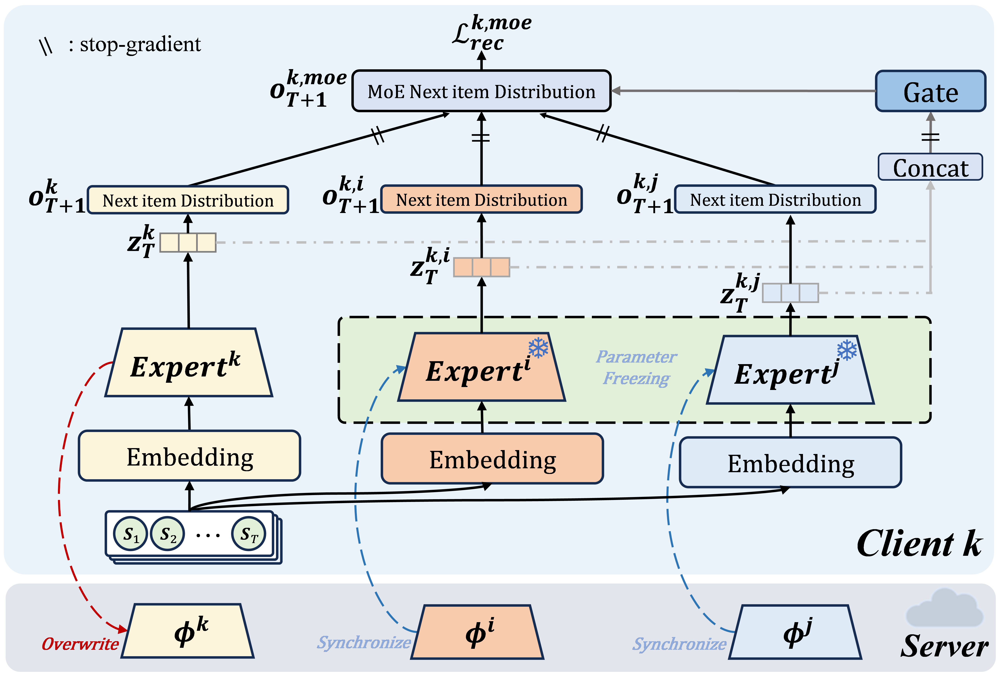

<p align="center">

</p>

<div align="center">

# FMoE-CDSR: Federated Mixture-of-Expert for Non-Overlapped Cross-Domain Sequential Recommendation
</div>

## Introduction

This is the source code of our ICDM'25 paper **Federated Mixture-of-Expert for Non-Overlapped Cross-Domain Sequential Recommendation**. In this paper, we propose **FMoE-CDSR**, a novel federated cross-domain sequential recommendation framework via Mixture of Experts (MoE). 

## Dependencies

Run the following command to install dependencies:
```bash
pip install -r requirements.txt
```
Note that our Python version is `3.8.13`.

## Dataset

There are three cross-domain scenarios which generated from the publicly available datasets of [Amazon](https://jmcauley.ucsd.edu/data/amazon/}{https://jmcauley.ucsd.edu/data/amazon/) (an e-commerce platform): Food-Kitchen-Cloth-Beauty (FKCB), Movie-Book-Game (MBG), and Sports-Garden-Home (SGH). 

The preprocessed CSR datasets can be downloaded from [Google Drive](https://drive.google.com/drive/folders/1NnZN3LhzdpxwaHiOW8GAUS8noTbdLlQt?usp=drive_link). You can download them and place them in the `./data` path of this project.

## Train & Eval

To train FMoE-CDSR, you can run the following command:

```bash
python -u main.py \
        --epochs 60 \
        --es_patience 10 \
        --local_epoch 3 \
        --eval_interval 1 \
        --frac 1.0 \
        --batch_size 256 \
        --log_dir log \
        --anneal_cap 1.0 \
        --lr 0.001 \
        --seed 42 \
        Food Kitchen Clothing Beauty
```
There are a few points to note:

- The positional arguments `Food Kitchen Clothing Beauty` indicates training FMoE-CDSR in FKCB scenario. If you want to choose another scenario, you can change it to `Movies Books Games` (MBG) or `Sports Garden Home` (SGH).

- The argument `--anneal_cap` is used to control KL annealing for variantional method (including ours). For FKCB, `1.0` is the best; for MBG and SGH, `0.01` is the best.

- The argument `--es_patience` is used to control how many epochs the algorithm will wait without seeing improvement in the monitored metric before early stop. For FKCB, `10` is the best; for MBG and SGH, `5` is the best.

To test FMoE-CDSR, you can run the following command:
```bash
python -u main.py \
        --log_dir log \
        --do_eval \
        --seed 42 \
        Food Kitchen Clothing Beauty
```